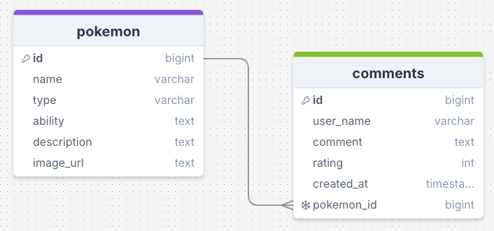
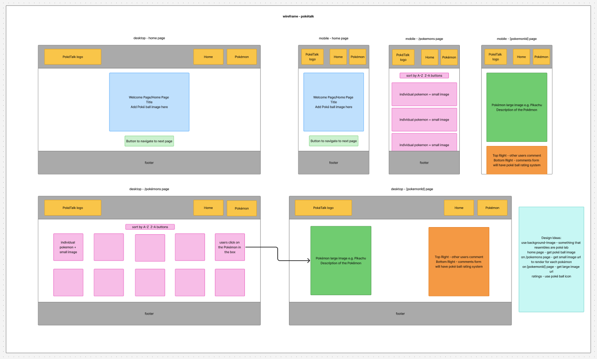

# Build a Blog with a Comments Form

Week 8 Assignment - Build a Comment Form

PokéTalk is a fan-made web app where users can share thoughts, leave comments, and rate their favorite Pokémon. Whether you're a longtime trainer or just starting your journey, join the conversation and connect with other fans through your favorite Pokémon!

## Requirements
- 🎯 Display all posts on the page, with an option to sort them in ascending or descending order. ✅
- 🎯 Create a SQL schema for a posts table and a comments table, with the comments being connected to the posts table with a foreign key. ✅
    - Please submit your database schema, as is mentioned in the submission instructions.
- 🎯 Create a delete button on posts that allows users to delete the post from the database. ✅
- 🎯 Create a form which saves comments to a dedicated comments table, with the comments being connected to the posts table with a foreign key. ✅
- 🎯 Allow users to comment on individual posts in their dynamic routes. Comments should be associated with posts, and have a dynamic route (e.g. ```/posts/:postid```). ✅ 
- 🎯 Add a redirect when a user creates a post to redirect them to the posts page. ✅

## Stretch Requirements
- 🏹 Implement a select input (or similar mechanism) that allows users to categorise posts during creation, storing them in their own table in the database. Ensure appropriate routing for categories, with endpoints such as /categories and /categories/:id to enable users to browse and interact with posts by category. ❌
- 🏹 Create an edit functionality accessible via ```/posts/:id/edit```, which pre-fills a form for post data. Create a working PUT route to update the post in the database. ✅ 
- 🏹 Develop an edit comment feature accessible via ```/posts/:id/comments/:id/edit```, which pre-fills a form for comment data. Create a working PUT route to update the comment in the database. ✅

## Reflection
This week, our task was to build a blog with a comments form where users could submit their thoughts. For my project, I created PokéTalk, a Pokémon review platform that lets users leave comments on their favourite Pokémon. Users can not only add comments but also edit or delete their own entries, giving them full control over their feedback.

Working with Next.js was a fun experience, although it took some time to adjust to the file-based routing system using multiple page.js files. At first, it felt a bit confusing, but as I kept building, I started to understand the structure and how it helps keep things organized. I really appreciated how Next.js handles server and database interactions more efficiently. However, I did find some parts—like adding images or setting up Google Fonts—more complex compared to React. In those areas, React felt a bit more straightforward. 

Regarding the redirect functionality, the assignment specified that users should be redirected to the post page after creating a post. In my app, however, users don’t add new Pokémon — they can only add, edit, or delete comments on existing Pokémon. Initially, I set up a redirect that sent users to the ```/pokemons``` page after submitting a comment, but I realized this didn’t make much sense for my app’s flow. Instead, I decided to keep the original redirect code in the ```/pokemons/page.js``` commented out and updated the comments form submission to redirect users back to the specific ```[pokemonId]``` page where they can immediately see their newly added comment. I believe this approach still fulfills the redirect requirement while providing a better user experience. Additionally, I implemented a similar redirect on the edit page so that after saving changes, users are taken back to the relevant ```[pokemonId]``` page.

What I would have loved to implement was using icons throughout my app, such as replacing the delete button with a trash icon. I did some research and watched YouTube tutorials, which mentioned that I needed to import the React Icons library to use icons in the app. However, I wasn’t sure about importing the entire library since I only needed a few icons. Initially, I tried adding a stylesheet link in the metadata of ```layout.js```, but it didn’t work as I hoped. In vanilla React, I could simply add a stylesheet link inside the ```<head>``` tag in ```index.html```, but with Next.js, it’s a bit different.

Update: To solve this, I added a ```<head>``` tag inside the RootLayout function in ```layout.js``` and included the Font Awesome CDN stylesheet link there. After that, I was able to successfully add icons to my app. I replaced the delete and edit buttons with icons and also added social media icons for GitHub and LinkedIn in the footer. Please let me know if this is the best way to do it or if there is an alternative solution to adding icons.

One thing I’m really happy with in my app is the small images I used on the ```/pokemons``` page. Although they appear a bit pixelated and blurry, I think that actually gives the app a charming, nostalgic old-school Pokémon vibe. I wanted to try something different with the Pokéball icons — usually, I would use JavaScript logic so that if a user selects the 4th Pokéball, all four icons would be highlighted. This time, I decided to experiment with CSS instead and discovered that the subsequent-sibling combinator (```~```) could achieve the same effect. This was a new approach for me, but I’m really happy with how it turned out.

I gave CSS Modules a try for styling but found it a bit more tedious. I used CSS Modules for my Header and Footer components, but for the rest of the styling, I either created separate CSS files or added styles directly in ```globals.css```.

I feel this assignment went really well. Not only did I complete all the required features, but I also attempted some of the stretch goals. Next.js made development easier by eliminating the need to set up a separate server file and create different endpoints for various HTTP requests. I appreciated how this reduced the amount of code I had to write. However, I found that working with images — especially remote ones — was a bit more involved. Since I was using external image URLs, I needed to explicitly allow those hosts by configuring ```remotePatterns``` in my ```next.config.js``` file. Once I did that, the images displayed correctly.

Overall, I’m very happy with how the app turned out, and all the functionality works as intended. Regarding one of the stretch goals — to create an edit functionality accessible via a route like ```/posts/:id/edit``` — I didn’t implement this for adding new Pokémon because users cannot add new Pokémon in my app. However, I did implement editing comments in a similar way, which is why I marked it as completed. I hope that the additional features I added, like using icons and enhanced styling, help make up for the stretch goal I didn’t implement in this assignment.

Any feedback will be appreciated as I am always looking for ways to continuously improve.

## Wireframe
For the planning, I initially started with drawing up how I want my database schema to look like. I use [drawSQL](https://drawsql.app/). 

<div align=center>

</div>

For my wireframe, I aimed to keep the homepage clean and minimalistic by focusing on key elements: the app title, a central Poké Ball image to establish the Pokémon theme, and a clear call-to-action button directing users to the ```/pokemons``` page. I incorporated a custom logo in the header to maintain visual consistency with the Pokémon brand. Overall, I remained faithful to my original wireframe layout. Initially, my plan for the ```/pokemons``` page was to simply display a list of Pokémon names. However, during development, I decided to enhance the user experience by including small images of each Pokémon. This visual addition helps users recognize the characters at a glance before navigating to their individual pages, where they can view detailed information, read comments from other users, and leave their own feedback through a comment form.

<div align=center>

</div>

## Resources
- https://nextjs.org/docs/app/api-reference/components/image
- https://nextjs.org/docs/app/api-reference/functions/use-pathname
- https://developer.mozilla.org/en-US/docs/Web/JavaScript/Reference/Global_Objects/Array/from 
- https://developer.mozilla.org/en-US/docs/Web/API/HTMLInputElement/defaultValue
- https://developer.mozilla.org/en-US/docs/Web/API/HTMLInputElement/defaultChecked
- https://developer.mozilla.org/en-US/docs/Web/CSS/Subsequent-sibling_combinator 
- https://cdnjs.com/libraries/font-awesome

## Credit 
Pokémon images used in this app are sourced from [PokeAPI/sprites](https://github.com/PokeAPI/sprites). All assets are provided by PokeAPI under fair use for non-commercial projects.

Pokémon information used in this app is sourced from the official [Pokémon Pokédex](https://www.pokemon.com/uk/pokedex) on Pokémon.com. All rights to character names, descriptions, and related content belong to The Pokémon Company.