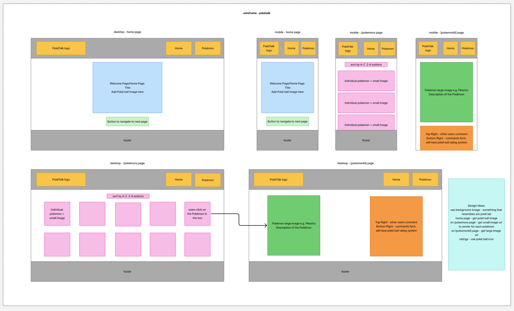

# Build a Blog with a Comments Form

Week 8 Assignment - Build a Comment Form

## Requirements
- 🎯 Display all posts on the page, with an option to sort them in ascending or descending order. ✅
- 🎯 Create a SQL schema for a posts table and a comments table, with the comments being connected to the posts table with a foreign key. ✅
    - Please submit your database schema, as is mentioned in the submission instructions.
- 🎯 Create a delete button on posts that allows users to delete the post from the database. ✅
- 🎯 Create a form which saves comments to a dedicated comments table, with the comments being connected to the posts table with a foreign key. ✅
- 🎯 Allow users to comment on individual posts in their dynamic routes. Comments should be associated with posts, and have a dynamic route (e.g. ```/posts/:postid```). ✅ 
- 🎯 Add a redirect when a user creates a post to redirect them to the posts page. ✅

## Stretch Requirements
- 🏹 Implement a select input (or similar mechanism) that allows users to categorise posts during creation, storing them in their own table in the database. Ensure appropriate routing for categories, with endpoints such as /categories and /categories/:id to enable users to browse and interact with posts by category.
- 🏹 Create an edit functionality accessible via /posts/:id/edit, which pre-fills a form for post data. Create a working PUT route to update the post in the database.
- 🏹 Develop an edit comment feature accessible via /posts/:id/comments/:id/edit, which pre-fills a form for comment data. Create a working PUT route to update the comment in the database.

## Reflection

## Wireframe
For the planning, I initially started with drawing up how I want my database schema to look like. I use [drawSQL](https://drawsql.app/). 

<div align=center>

</div>

For my wireframe, I aimed to keep the homepage clean and minimalistic by focusing on key elements: the app title, a central Poké Ball image to establish the Pokémon theme, and a clear call-to-action button directing users to the ```/pokemons``` page. I incorporated a custom logo in the header to maintain visual consistency with the Pokémon brand. Overall, I remained faithful to my original wireframe layout. Initially, my plan for the ```/pokemons``` page was to simply display a list of Pokémon names. However, during development, I decided to enhance the user experience by including small images of each Pokémon. This visual addition helps users recognize the characters at a glance before navigating to their individual pages, where they can view detailed information, read comments from other users, and leave their own feedback through a comment form.

<div align=center>

</div>

## Errors or Bugs

## Resources
- https://nextjs.org/docs/app/api-reference/components/image
- https://nextjs.org/docs/app/api-reference/functions/use-pathname
- https://developer.mozilla.org/en-US/docs/Web/JavaScript/Reference/Global_Objects/Array/from 
