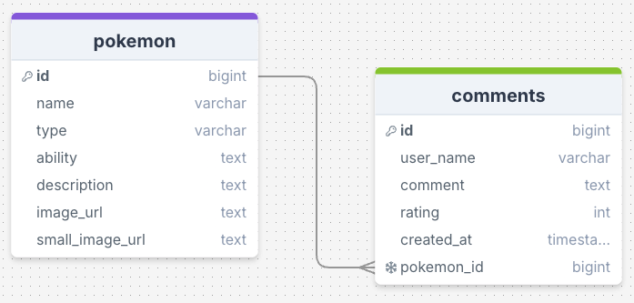

# Build a Blog with a Comments Form

Week 8 Assignment - Build a Comment Form

## Requirements
- 🎯 Display all posts on the page, with an option to sort them in ascending or descending order.
- 🎯 Create a SQL schema for a posts table and a comments table, with the comments being connected to the posts table with a foreign key. ✅
    - Please submit your database schema, as is mentioned in the submission instructions.
- 🎯 Create a delete button on posts that allows users to delete the post from the database.
- 🎯 Create a form which saves comments to a dedicated comments table, with the comments being connected to the posts table with a foreign key.
- 🎯 Allow users to comment on individual posts in their dynamic routes. Comments should be associated with posts, and have a dynamic route (e.g. ```/posts/:postid```).
- 🎯 Add a redirect when a user creates a post to redirect them to the posts page. 

## Stretch Requirements
- 🏹 Implement a select input (or similar mechanism) that allows users to categorise posts during creation, storing them in their own table in the database. Ensure appropriate routing for categories, with endpoints such as /categories and /categories/:id to enable users to browse and interact with posts by category.
- 🏹 Create an edit functionality accessible via /posts/:id/edit, which pre-fills a form for post data. Create a working PUT route to update the post in the database.
- 🏹 Develop an edit comment feature accessible via /posts/:id/comments/:id/edit, which pre-fills a form for comment data. Create a working PUT route to update the comment in the database.

## Reflection

## Wireframe
<div align=center>

</div>

## Resources